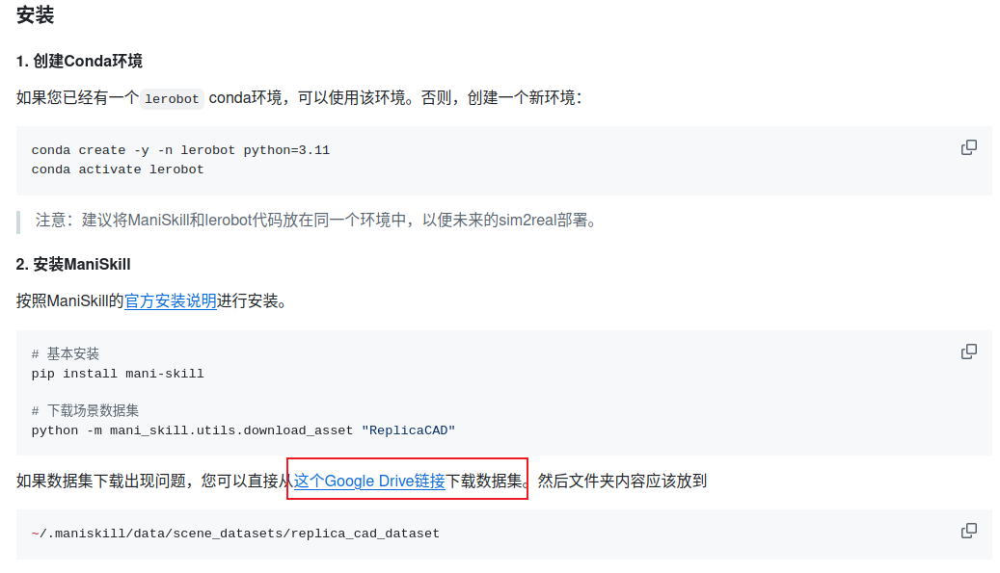

# 强化学习

## MuJoCo

## ManiSkill + SAPIE

这里涉及 ubuntu 配置 nividia 驱动，有以下博客可以参考：
[Ubuntu 安装 cuda+cudnn 保姆级教程记录](https://zhuanlan.zhihu.com/p/691711768)
[cuDnn 下载官方网站](https://developer.nvidia.com/cudnn-downloads?target_os=Linux&target_arch=x86_64&Distribution=Ubuntu&target_version=22.04&target_type=deb_local)

可以参考的博客有：

- [SAPIEN ManiSkill3 入门教程（二）](https://www.e-com-net.com/article/1921419596703789056.htm)
- [github 仓库指引](https://github.com/Vector-Wangel/XLeRobot/blob/main/docs/zh/source/simulation/getting_started/index.md)
  其中场景的下载可以从 github 中提示的 google drive 链接中下载，这个是最小的，有兴趣的可以下载其他的场景，具体介绍见[Scene Datasets](https://maniskill.readthedocs.io/en/latest/user_guide/datasets/scenes.html)（先尝试运行里面的代码下载场景文件，如果提示网络超时，就使用终端中提示的路径如 https://huggingface...直接复制到浏览器即可下载，实测好用！）：
  

运行 github 代码后会进入以下界面：

目前探索到的常用操作如下：

- `wasd`按键可以朝向目前屏幕方向前后左右移动
- 长按鼠标右键可以更改屏幕朝向
- 转动鼠标滚轮可以释放放大视图

如果需要开始控制机器人关节操作，先点击上图中右侧的终端，使其处于被选中状态，这个时候键盘按键对于关节控制操作，移动操作暂时失效。如需再移动点击其他地方不选中终端即可。

使用期间可以点击左上角的`Camera`，将`None`切换为头部或者手臂均可。
