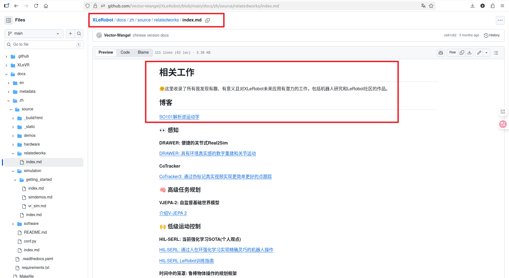

# 电机 & 机器人姿态学习

## ST3215 资料收集：

1. 具体介绍、总线协议资料等：[ST3215 Servo - Waveshare Wiki](https://www.waveshare.net/wiki/ST3215_Servo#.E6.96.87.E6.A1.A3)
2. [UART 串行总线舵机 ST3215-HS 高转速 20KG.CM 360° 磁编码器大扭矩](https://spotpear.cn/wiki/Serial-UART-Bus-Magnetic-Encoder-ST3215-HS-Servo-Motor-20kg-High-Speed.html)
3. STM32 串口控制 & 上位机 ：[飞特舵机 python_mob64ca13fc220d 的技术博客\_51CTO 博客](https://blog.51cto.com/u_16213599/13264119)
4. 飞特电机上位机：[FEETECH 飞特舵机 FD 调试软件的安装与使用 - 章工舵机测评的文章 - 知乎](https://zhuanlan.zhihu.com/p/345309655)
5. 舵机 SDK 和软件下载：[舵机使用说明&固件下载](http://www.scservo.com/#!index.md)
6. 项目路径`src\lerobot\motors\feetech`有`FeetechMotorBus`类封装

## 机械臂运动学逆解

github 仓库有对于 2 关节运动学逆解解析，可以搭配手写笔记进行分析学习。

