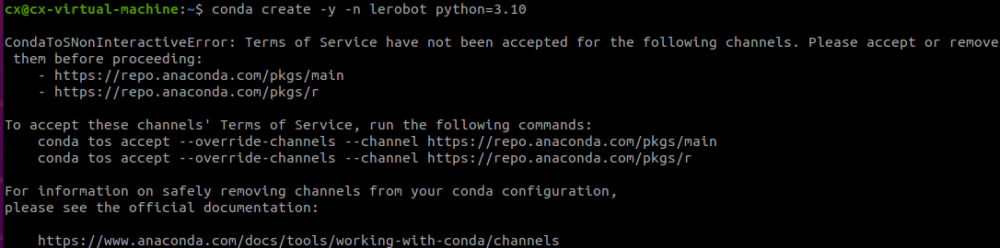

# 树莓派 & Linux 系统

## 必备 Linux 技能：

- 基本命令行操作(cd、pwd、mv、cp、chmod、sudo 等)：[【20 分钟学会 Linux 的基本操作】](https://www.bilibili.com/video/BV1LV411j7H3?vd_source=b313f11521a9a14487c38aa4fa1c5066)
- 文件权限和用户管理(chmod)：[Linux 命令大全 | 菜鸟教程](https://www.runoob.com/linux/linux-command-manual.html)
- 进程管理和服务
- USB 设备管理 (/dev/ttyUSB\*)(只有几条指令，可以直接问 AI)：[CSDN 相关博客](https://blog.csdn.net/whh_bjqy/article/details/149041376?fromshare=blogdetail&sharetype=blogdetail&sharerId=149041376&sharerefer=PC&sharesource=m0_74029092&sharefrom=from_link)
- 网络配置和 SSH(主要用于电脑连接树莓派开发)：
  1.  [在 Linux 中，如何配置网络？ -阿里云开发者社区](https://developer.aliyun.com/article/1593907)
  2.  [VScode SSH 远程虚拟机中 ubuntu 系统开发以及解决 SSH 需要频繁输入密码问题 - 长不胖的小鱼 - 博客园](https://www.cnblogs.com/Super-why/p/15661862.html)

## 下载配置 Ubuntu 20.04 LTS

[【Win11 环境下 Ubuntu 系统（Linux）虚拟机安装&双系统安装（虚拟机）】](https://www.bilibili.com/video/BV1nb4y147Vc?vd_source=b313f11521a9a14487c38aa4fa1c5066)

## 树莓派学习

1. 树莓派无线安装: [博客教程](https://blog.csdn.net/2301_79835444/article/details/142747112?fromshare=blogdetail&sharetype=blogdetail&sharerId=142747112&sharerefer=PC&sharesource=m0_74029092&sharefrom=from_link)

```python
# 常用开启vnc方式
vncserver

vncserver-virtual
```

1. 帮助解决没有密码登录权限问题！！！[树莓派 ssh 免密登录 - jesn - 博客园](https://www.cnblogs.com/jesn/articles/14317949.html)
2. 由于开源代码中主要是 python 语言实现，所以可以着重看 python 部分的实现：[【创乐博 raspberry pi 树莓派 4B 开发套件教程 C/C++及 Python 开发从入门到精通教学视频 2023 持续更新中……】](https://www.bilibili.com/video/BV1TF411y7kn?vd_source=b313f11521a9a14487c38aa4fa1c5066)
3. 由于大部分代码设计电机的串口控制，所以可以自行查看树莓派 python 语言下实现的串口通信：[初学树莓派——（五）树莓派串口收发（硬件串口） - naive156 - 博客园](https://www.cnblogs.com/popepy/p/18470035)
4. 树莓派 VNC 连接灰屏解决：[个人解决树莓派 5 使用 VNC Viewer 灰屏问题,供参考 - 哔哩哔哩](https://www.bilibili.com/opus/1083615112051294228)

## 树莓派环境配置

1. 文档指引`docs\zh\source\software\index.md`
2. 树莓派 3B+ miniconda 安装：[miniconda](https://blog.csdn.net/weixin_43710676/article/details/129002349)
3. 树莓派 5 miniconda 安装 [miniconda](https://blog.csdn.net/guojingyue123/article/details/138106749?fromshare=blogdetail&sharetype=blogdetail&sharerId=138106749&sharerefer=PC&sharesource=m0_74029092&sharefrom=from_link)
4. Ubuntu20.04 下载 miniconda：[Ubuntu 20.04 版本快速安装 Miniconda（宝宝级攻略）\_miniconda ubuntu-CSDN 博客](https://blog.csdn.net/2301_76831056/article/details/143165738)
5. Miniconda 环境接受条款！：[miniconda error:CondaToSNonInteractiveError - 技术栈](https://jishuzhan.net/article/1958023261471682561)
   
6. 其中如果选择 github 下载(From Source)，可以通过两个个方法下载，当然你可以尝试 From PyPI(貌似直接 all 更快，省去了后面单独下载电机控制那些的依赖)
   - 第一个：linux 环境下魔法(clash for linux)： [Linux 一键安装 Clash | 棉花糖](https://mhter.com/archives/linux-yi-jian-an-zhuang-clash)，至于订阅节点嘛各位懂的
   - 第二个：Win 下先下载仓库源码，然后直接拖到虚拟机即可(前提是你的 Ubuntu 下载了 VMware Tool，一般都是默认有下载的)，如果没有可以选用`FileZilla Client`软件连接后传输文件
