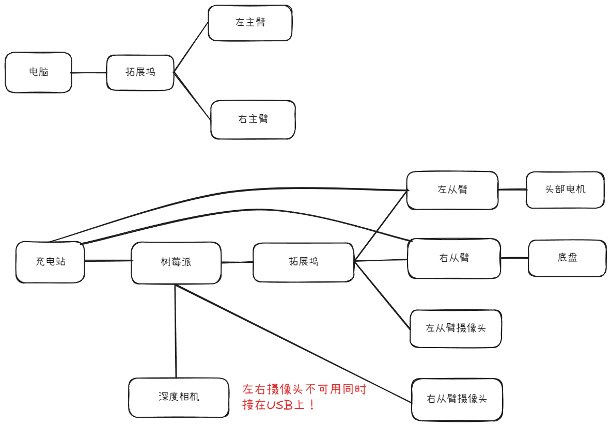
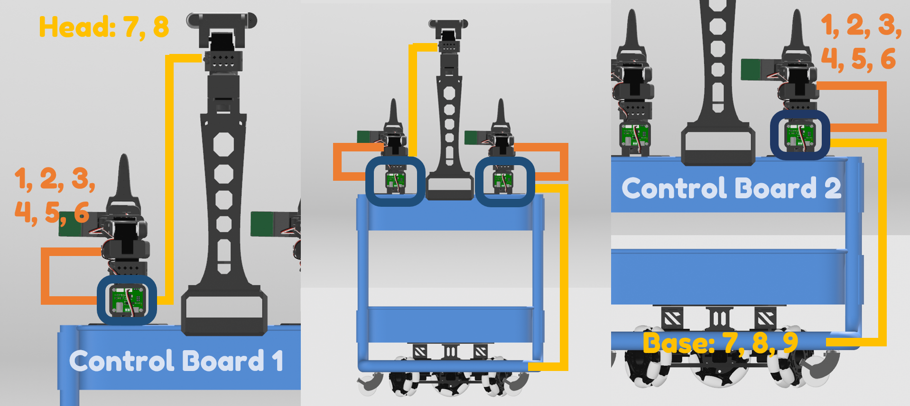
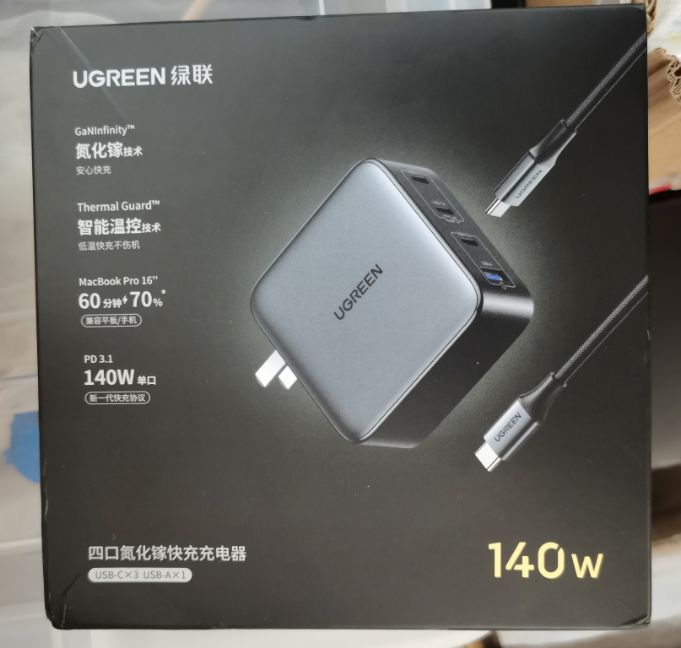

# 硬件连接与常用命令

## 一、全连接

### 1.1 连接框图




### 1.2 部分实物连接图


左从臂和右从臂均通过购买的 5264 3P 线连接(注意使用反向的线！部分就正负接反了！可以自己对照着看，比如 D 引脚走到另一边接上控制板是不是也对应 D 引脚)

ps: 特别注意这里的左右臂摄像头不可用同时接在拓展坞上！不然运行程序的时候会提示通道冲突，导致程序无法运行

## 二、充电站 & 充电器

充电的时候可以使用购买的 140W 快充头


将其连接到绿联充电站的 USB1 口(左下第一个，写着 IN/OUT3)进行充电


## 三、连接检查流程

### 3.1 电脑部分

#### 激活环境

```bash
conda activate lerobot  # 激活环境

cd lerobot-0918 # 这里进入你存储的项目路径
```

#### 配置左右机械臂

```bash
lerobot-find-port
```

通常直接拔掉左臂的 USB 线看看是不是`/dev/ttyACM0`，如果不是则拔掉两个机械臂 USB 线，先插左臂，再插右臂一般就可以做到左臂端口`/dev/ttyACM0`，右臂端口`/dev/ttyACM1`

然后通过`chmod`使能

```bash
sudo chmod 666 /dev/ttyACM0
sudo chmod 666 /dev/ttyACM1

# 也可以一个命令解决
sudo chmod 666 /dev/ttyACM*
```

### 3.2 树莓派环节

前面电机部分就同理了

#### 摄像头环节

通过一下命令找到摄像头

```bash
lerobot-find-cameras opencv  # 查看左右臂摄像头

lerobot-find-cameras realsense # 查看深度摄像头
```

opencv 摄像头输出 FPS=30，表示该摄像头是可用的
不过由于深度相机也有 2 个 opencv 的摄像头，所以是在输出信息太多无法分辨时，可以先拔掉深度相机再运行该命令

```
--- Detected Cameras ---
Camera #0:
  Name: OpenCV Camera @ /dev/video2
  Type: OpenCV
  Id: /dev/video2
  Backend api: V4L2
  Default stream profile:
    Format: 0.0
    Width: 640
    Height: 480
    Fps: 30.0
--------------------
Camera #1:
  Name: OpenCV Camera @ /dev/video23
  Type: OpenCV
  Id: /dev/video23
  Backend api: V4L2
  Default stream profile:
    Format: 0.0
    Width: 640
    Height: 480
    Fps: -1.0
--------------------
Camera #2:
  Name: OpenCV Camera @ /dev/video24
  Type: OpenCV
  Id: /dev/video24
  Backend api: V4L2
  Default stream profile:
    Format: 0.0
    Width: 640
    Height: 480
    Fps: -1.0
--------------------
Camera #3:
  Name: OpenCV Camera @ /dev/video25
  Type: OpenCV
  Id: /dev/video25
  Backend api: V4L2
  Default stream profile:
    Format: 0.0
    Width: 640
    Height: 480
    Fps: -1.0
--------------------
Camera #4:
  Name: OpenCV Camera @ /dev/video26
  Type: OpenCV
  Id: /dev/video26
  Backend api: V4L2
  Default stream profile:
    Format: 0.0
    Width: 640
    Height: 480
    Fps: -1.0
--------------------
Camera #5:
  Name: OpenCV Camera @ /dev/video31
  Type: OpenCV
  Id: /dev/video31
  Backend api: V4L2
  Default stream profile:
    Format: 0.0
    Width: 640
    Height: 480
    Fps: -1.0
--------------------
Camera #6:
  Name: OpenCV Camera @ /dev/video32
  Type: OpenCV
  Id: /dev/video32
  Backend api: V4L2
  Default stream profile:
    Format: 0.0
    Width: 640
    Height: 480
    Fps: -1.0
--------------------
Camera #7:
  Name: OpenCV Camera @ /dev/video33
  Type: OpenCV
  Id: /dev/video33
  Backend api: V4L2
  Default stream profile:
    Format: 0.0
    Width: 640
    Height: 480
    Fps: -1.0
--------------------
Camera #8:
  Name: OpenCV Camera @ /dev/video34
  Type: OpenCV
  Id: /dev/video34
  Backend api: V4L2
  Default stream profile:
    Format: 0.0
    Width: 640
    Height: 480
    Fps: -1.0
--------------------
Camera #9:
  Name: OpenCV Camera @ /dev/video4
  Type: OpenCV
  Id: /dev/video4
  Backend api: V4L2
  Default stream profile:
    Format: 0.0
    Width: 640
    Height: 480
    Fps: 30.0
--------------------
Camera #10:
  Name: OpenCV Camera @ /dev/video6
  Type: OpenCV
  Id: /dev/video6
  Backend api: V4L2
  Default stream profile:
    Format: 0.0
    Width: 640
    Height: 480
    Fps: 30.0
--------------------
Camera #11:
  Name: OpenCV Camera @ /dev/video8
  Type: OpenCV
  Id: /dev/video8
  Backend api: V4L2
  Default stream profile:
    Format: 0.0
    Width: 640
    Height: 480
    Fps: 30.0
--------------------
```

至此将找到的摄像头信息加入到`src/lerobot/robots/so101_bimanual_remote/so101_bimanual_all_host.py`中配置摄像头部分

```C
    # ============================================
    # 配置双臂从臂机器人
    # ============================================
        # ...existing code
        # 相机配置:
        cameras={
             # 修改这里的index_or_path
            "left": OpenCVCameraConfig(index_or_path="/dev/video8", width=640, height=480, fps=30),
            "right": OpenCVCameraConfig(index_or_path="/dev/video0", width=640, height=480, fps=30),
            "head": RealSenseCameraConfig(
                serial_number_or_name="935722061309",  # Replace with camera SN
                fps=15,
                width=640,
                height=480,
                color_mode=ColorMode.RGB, # Request BGR output
                rotation=Cv2Rotation.NO_ROTATION,
                use_depth=True
            ),
        },
        # ...existing code
```

同理输入`lerobot-find-cameras realsense`

```bash
--- Detected Cameras ---
Camera #0:
  Name: Intel RealSense D415
  Type: RealSense
  Id: 935722061309
  Firmware version: 5.17.0.10
  Usb type descriptor: 2.1
  Physical port: /sys/devices/platform/axi/1000120000.pcie/1f00300000.usb/xhci-hcd.1/usb3/3-2/3-2:1.0/video4linux/video0
  Product id: 0AD3
  Product line: D400
  Default stream profile:
    Stream_type: Color
    Format: rgb8
    Width: 640
    Height: 480
    Fps: 15
--------------------
```

将以上找到的`Id`写到配置代码`serial_number_or_name`中

```C
    # ============================================
    # 配置双臂从臂机器人
    # ============================================
        # ...existing code
        # 相机配置:
        cameras={

            "left": OpenCVCameraConfig(index_or_path="/dev/video8", width=640, height=480, fps=30),
            "right": OpenCVCameraConfig(index_or_path="/dev/video0", width=640, height=480, fps=30),
            "head": RealSenseCameraConfig(
                # 修改这里的serial_number_or_name
                serial_number_or_name="935722061309",  # Replace with camera SN
                fps=15,
                width=640,
                height=480,
                color_mode=ColorMode.RGB, # Request BGR output
                rotation=Cv2Rotation.NO_ROTATION,
                use_depth=True
            ),
        },
        # ...existing code
```

### 3.3 电机部分

由于全连接后左右从臂会加上头部电机和底盘电机，所以需要通过 windows 端的上位机进行查看具体请看：[FEETECH 飞特舵机 FD 调试软件的安装与使用 - 章工舵机测评的文章 - 知乎](https://zhuanlan.zhihu.com/p/345309655)

保证左臂可以检测到 1-7,右臂可以检测到 1-9！

## 四、连接过程常见问题

1. 如果发现突然代码运行到一半程序卡住了，请立刻切断机械臂的电源，这是因为有舵机过载无法使用了(一般是手腕旋转舵机发热最严重)，让电机冷却后再使用，不然会烧毁电机！

2. 如果发现出现/dev/ttyACM\*无法识别的请看，请断开 USB 和电源线后，再重新插入以及 sudo 使能即可。

3. 运行连接代码的时候注意要先启动`src/lerobot/robots/so101_bimanual_remote/so101_bimanual_host.py`，再启动`examples/so101_bimanual_remote/teleoperate.py`

同理启动全连接代码时，先运行`src/lerobot/robots/so101_bimanual_remote/so101_bimanual_all_host.py`，再运行`examples/so101_bimanual_remote/teleoperate_all.py`

## 五、常用命令

### 激活环境：

```
conda activate lerobot
```

### 查找电机

```
lerobot-find-port
```

### 赋予电机权限

```
sudo chmod 666 /dev/ttyACM0
sudo chmod 666 /dev/ttyACM1

# 全部赋予：
sudo chmod 666 /dev/ttyACM*
```

### 校准电机

```
## 从臂
lerobot-calibrate \
    --robot.type=so101_follower \
    --robot.port=/dev/ttyACM0 \ # <- The port of your robot
    --robot.id=my_awesome_follower_arm # <- Give the robot a unique name

## 主臂
lerobot-calibrate \
    --teleop.type=so101_leader \
    --teleop.port=/dev/ttyACM1 \ # <- The port of your robot
    --teleop.id=my_awesome_leader_arm # <- Give the robot a unique name
```

### 查找相机

```
lerobot-find-cameras opencv
lerobot-find-cameras realsense
```

### 遥操

```
# 一主一从摇操
lerobot-teleoperate \
    --robot.type=so101_follower \
    --robot.port=/dev/ttyACM0 \
    --robot.id=my_awesome_follower_arm \
    --teleop.type=so101_leader \
    --teleop.port=/dev/ttyACM1 \
    --teleop.id=my_awesome_leader_arm


# 带摄像头摇操
lerobot-teleoperate \
    --robot.type=so101_follower \
    --robot.port=/dev/ttyACM0 \
    --robot.id=my_awesome_follower_arm \
    --robot.cameras="{ left: {type: opencv, index_or_path: 2, width: 1920, height: 1080, fps: 30}}" \
    --teleop.type=so101_leader \
    --teleop.port=/dev/ttyACM1 \
    --teleop.id=my_awesome_leader_arm \
    --display_data=true

# 多摄像头摇操
lerobot-teleoperate \
    --robot.type=so101_follower \
    --robot.port=/dev/ttyACM0 \
    --robot.id=my_awesome_follower_arm \
    --robot.cameras="{ left: {type: opencv, index_or_path: 2, width: 640, height: 480, fps: 30}, front: {type: opencv, index_or_path: 8, width: 640, height: 480, fps: 30}}" \
    --teleop.type=so101_leader \
    --teleop.port=/dev/ttyACM1 \
    --teleop.id=my_awesome_leader_arm \
    --display_data=true


# 两主两从遥操(未尝试过)
lerobot-teleoperate \
  --robot.type=bi_so100_follower \
  --robot.left_arm_port=/dev/tty.usbmodem5A460851411 \
  --robot.right_arm_port=/dev/tty.usbmodem5A460812391 \
  --robot.id=bimanual_follower \
  --robot.cameras='{
    left: {"type": "opencv", "index_or_path": 0, "width": 1920, "height": 1080, "fps": 30},
    top: {"type": "opencv", "index_or_path": 1, "width": 1920, "height": 1080, "fps": 30},
    right: {"type": "opencv", "index_or_path": 2, "width": 1920, "height": 1080, "fps": 30}
  }' \
  --teleop.type=bi_so100_leader \
  --teleop.left_arm_port=/dev/tty.usbmodem5A460828611 \
  --teleop.right_arm_port=/dev/tty.usbmodem5A460826981 \
  --teleop.id=bimanual_leader \
  --display_data=true
```

### 采集数据集

```
# 采集数据集，并保存在本地
lerobot-record \
    --robot.type=so101_follower \
    --robot.port=/dev/ttyACM0 \
    --robot.id=my_awesome_follower_arm \
    --robot.cameras="{ left: {type: opencv, index_or_path: 2, width: 640, height: 480, fps: 30}, front: {type: opencv, index_or_path: 8, width: 640, height: 480, fps: 30}}" \
    --teleop.type=so101_leader \
    --teleop.port=/dev/ttyACM1 \
    --teleop.id=my_awesome_leader_arm \
    --display_data=true \
    --dataset.repo_id=CX1103/test \
    --dataset.num_episodes=6 \
    --dataset.single_task="Grab the black cube" \
    --dataset.push_to_hub=false \
    --dataset.episode_time_s=30 \
    --dataset.reset_time_s=30
```

### 配置 HugginFace

```
# 配置HuggingFace

# 请将下面替换为你的HuggingFace写入权限令牌
your_hugging_face_write_token_here

## 使用具有写入权限的令牌登录
hf auth login --token ${HUGGINGFACE_TOKEN} --add-to-git-credential

## 配置 git credential helper（可选）
git config --global credential.helper store

## 将令牌写入环境
HF_USER=$(hf whoami | head -n 1)
echo $HF_USER
```

### 采集数据集(HuggingFace 版)

```
# 采集5个回合并将您的数据集上传到 Hub
lerobot-record \
    --robot.type=so101_follower \
    --robot.port=/dev/ttyACM0 \
    --robot.id=my_awesome_follower_arm \
    --robot.cameras="{ front: {type: opencv, index_or_path: 2, width: 640, height: 480, fps: 30}, side: {type: opencv, index_or_path: 8, width: 640, height: 480, fps: 30}}" \
    --teleop.type=so101_leader \
    --teleop.port=/dev/ttyACM1 \
    --teleop.id=my_awesome_leader_arm \
    --display_data=true \
    --dataset.repo_id=${HF_USER}/record-test \
    --dataset.num_episodes=5 \
    --dataset.single_task="Grab the black cube" \
    --dataset.push_to_hub=true \
    --dataset.episode_time_s=30 \
    --dataset.reset_time_s=30
```

### 数据回显

```
# 数据回显
## 如果您没有使用 --dataset.push_to_hub=false ，并上传了数据，您也可以在本地通过以下命令进行可视化
lerobot-dataset-viz \
  --repo-id ${HF_USER}/so101_test \

## 如果您使用了 --dataset.push_to_hub=false ，没有上传数据，您也可以通过以下命令在本地进行可视化：
lerobot-dataset-viz \
  --repo-id seeedstudio123/test \
```

### 回放数据集

```
# 回放一个数据集
lerobot-replay \
    --robot.type=so101_follower \
    --robot.port=/dev/ttyACM0 \
    --robot.id=my_awesome_follower_arm \
    --dataset.repo_id=${HF_USER}/record-test \
    --dataset.episode=0

lerobot-replay \
    --robot.type=so101_follower \
    --robot.port=/dev/ttyACM0 \
    --robot.id=my_awesome_follower_arm \
    --dataset.repo_id=CX1103/test \
    --dataset.episode=0
```

### 训练模型

```
# 训练
lerobot-train \
  --dataset.repo_id=${HF_USER}/so101_test \
  --policy.type=act \
  --output_dir=outputs/train/act_so101_test \
  --job_name=act_so101_test \
  --policy.device=cuda \
  --wandb.enable=true \
  --policy.repo_id=${HF_USER}/my_policy

lerobot-train \
  --dataset.repo_id=CX1102/test \
  --policy.type=act \
  --output_dir=outputs/train/act_so101_test \
  --job_name=act_so101_test \
  --policy.device=cuda \
  --wandb.enable=false \
  --policy.push_to_hub=false\
  --policy.repo_id=CX1102/act_so101_test

## --steps=100000默认步数为10w，需要时可以加大
```

### 评估模型

```
# 评估
lerobot-record  \
  --robot.type=so100_follower \
  --robot.port=/dev/ttyACM1 \
  --robot.cameras="{ up: {type: opencv, index_or_path: 2, width: 640, height: 480, fps: 30}, side: {type: intelrealsense, serial_number_or_name: 233522074606, width: 640, height: 480, fps: 30}}" \
  --robot.id=my_awesome_follower_arm \
  --display_data=true \
  --dataset.repo_id=CX1102/eval_so100 \
  --dataset.single_task="Put lego brick into the transparent box" \
  # <- Teleop optional if you want to teleoperate in between episodes \
  # --teleop.type=so100_leader \
  # --teleop.port=/dev/ttyACM0 \
  # --teleop.id=my_awesome_leader_arm \
  --policy.path=CX1102/act_so101_test


lerobot-record  \
  --robot.type=so101_follower \
  --robot.port=/dev/ttyACM0 \
  --robot.cameras="{ left: {type: opencv, index_or_path: 2, width: 640, height: 480, fps: 30}, front: {type: opencv, index_or_path: 8, width: 640, height: 480, fps: 30}}" \
  --robot.id=my_awesome_follower_arm \
  --display_data=true \
  --dataset.repo_id=CX1102/eval_so101 \
  --dataset.single_task="Put lego brick into the transparent box" \
  --policy.path=outputs/train/act_so101_test/checkpoints/last/pretrained_model \
  --dataset.push_to_hub=false
```
