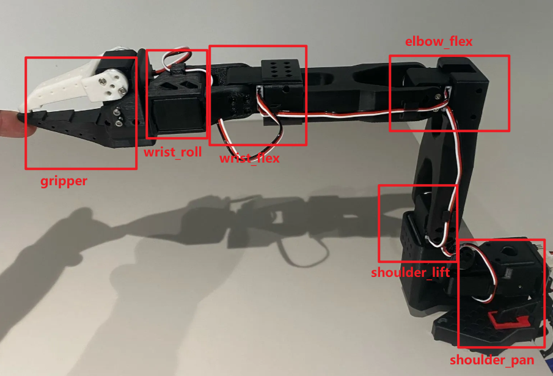

# 项目 Github 仓库 & B 站平台视频

XLeRobot 仓库：[Vector-Wangel/XLeRobot: XLeRobot: Practical Dual-Arm Mobile Home Robot for $660](https://github.com/Vector-Wangel/XLeRobot/tree/main)

LeRobot 仓库：[huggingface/lerobot: 🤗 LeRobot: Making AI for Robotics more accessible with end-to-end learning](https://github.com/huggingface/lerobot)

LeRobot HuggingFace：[lerobot (LeRobot)](https://huggingface.co/lerobot)

LeRobot 中文社区：[首页 | WowRobo Wiki - LeRobot 中文社区](https://wiki.wowrobo.com/)

B 站视频：[【XLeRobot 家务展示 4 千成本（近期开卖）】](https://www.bilibili.com/video/BV1bbaFzLEga?vd_source=b313f11521a9a14487c38aa4fa1c5066)

B 站视频：[【新版 Lerobot SO101 机械臂教程一站通：5. 机械臂校准及遥操作】](https://www.bilibili.com/video/BV1i2bazGEHo?vd_source=b313f11521a9a14487c38aa4fa1c5066)

B 站视频对应讲义 ↑：[小小工程师](https://wiki.seeedstudio.com/cn/lerobot_so100m_new)

远程(两主两从)控制私人仓库：[so101 双臂远程遥操和 lekiwi 底盘的单独控制](https://github.com/brucecai-2001/lerobot_piper)
↑ 视频链接：[【【Xlerobot 复刻】家具与机器人无限的可能性】](https://www.bilibili.com/video/BV1ooGWzyE8a/?share_source=copy_web&vd_source=b313f11521a9a14487c38aa4fa1c5066)

> [!NOTE] 注意
> 以下连接仅为个人短时间内收集到的，不一定是最全最好的教程，各位可以根据项目中的需要进行查缺补漏，自行寻找更好的视频&博客资源。
