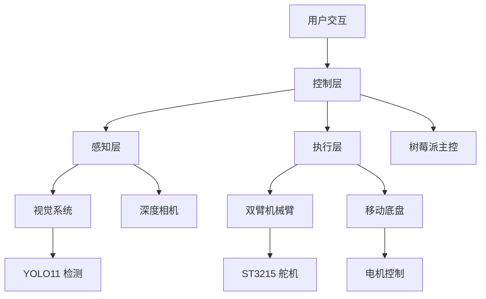

# 项目介绍

## 🎯 项目目标

XLeRobot 旨在打造一个**低成本、高性能、易复制**的双臂移动家庭机器人，让更多人能够接触和学习机器人技术。

## 💡 项目特点

### 1. 低成本设计

- **总成本约 $660（~4000 元）**
- 使用开源硬件和软件
- 易于采购的标准件
- 详细的 BOM 清单

### 2. 实用功能

- ✅ 双臂协调操作
- ✅ 自主移动导航
- ✅ 视觉目标检测
- ✅ 遥操作控制
- ✅ 强化学习训练

### 3. 开源生态

- 🌟 完整开源代码
- 📚 详细技术文档
- 🎥 视频教程支持
- 💬 活跃社区讨论

## 🏗️ 系统架构

## 📈 技术指标

| 指标             | 参数         |
| ---------------- | ------------ |
| **机械臂自由度** | 每臂 6 DOF   |
| **负载能力**     | 约 500g      |
| **移动速度**     | 最大 0.5 m/s |
| **视觉范围**     | 60° FOV      |
| **电池续航**     | 约 2-3 小时  |
| **控制延迟**     | < 100ms      |

## 🎨 应用场景

### 家庭场景

- 🧹 物品整理
- 🍽️ 简单烹饪辅助
- 📦 物品搬运
- 🎮 娱乐互动

### 教育场景

- 🎓 机器人教学
- 🔬 科研实验
- 💻 编程学习
- 🤖 人工智能演示

### 研究场景

- 📊 强化学习研究
- 🦾 机器人操作研究
- 👁️ 视觉导航研究
- 🧪 人机交互研究

## 📸 项目展示

!!! example "实物展示"

    *双臂移动机器人整体外观*

## 🌟 项目里程碑

- [x] **2024.Q1** - 硬件设计完成
- [x] **2024.Q2** - 软件框架搭建
- [x] **2024.Q3** - 遥操作功能实现
- [x] **2024.Q4** - 视觉检测集成
- [ ] **2025.Q1** - 强化学习训练
- [ ] **2025.Q2** - 自主任务执行

## 👥 团队介绍

本项目由开源社区共同维护，主要贡献者包括：

- **Vector-Wangel** - 项目创始人
- **开源社区** - 代码贡献者
- **测试志愿者** - 功能测试和反馈

!!! tip "加入我们"
欢迎对机器人感兴趣的朋友加入项目！无论是代码贡献、文档完善还是问题反馈，都非常欢迎！
