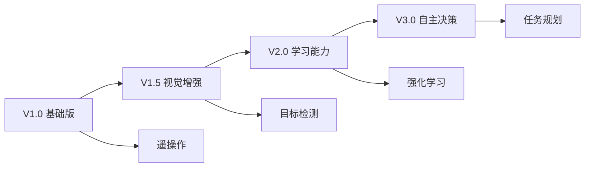

# 技术栈

## 🏗️ 整体架构

XLeRobot 采用模块化设计，主要技术栈包括硬件平台、软件框架、视觉系统、控制系统和通讯协议等。

## 💻 软件技术栈

### 编程语言

- **Python 3.10+** - 主要开发语言
- **C/C++** - 底层硬件控制
- **Shell Script** - 系统配置脚本

### 核心框架

| 技术        | 版本   | 用途           |
| ----------- | ------ | -------------- |
| **LeRobot** | Latest | 机器人学习框架 |
| **PyTorch** | 2.0+   | 深度学习框架   |
| **OpenCV**  | 4.x    | 计算机视觉     |
| **NumPy**   | Latest | 数值计算       |

### 视觉系统

#### YOLO 目标检测

```python
from ultralytics import YOLO

# 使用 YOLO11n 模型
model = YOLO('yolo11n.pt')
results = model.predict(source='image.jpg')
```

- **模型**: YOLOv11n (nano 版本)
- **库**: [Ultralytics](https://github.com/ultralytics/ultralytics)
- **用途**: 实时目标检测和识别

#### 深度视觉

- **Intel RealSense D415** - RGB-D 深度相机
- **librealsense SDK** - 相机驱动和接口
- **用途**: 3D 点云、深度估计、VR 交互

### 机器学习

#### 强化学习环境

```python
# MuJoCo 物理仿真
import mujoco
import gymnasium as gym

# ManiSkill3 + SAPIEN
import mani_skill.envs
env = gym.make("PickCube-v1")
```

- **MuJoCo** - 物理仿真引擎
- **ManiSkill3** - 机器人操作环境
- **SAPIEN** - 场景构建框架
- **Gymnasium** - RL 环境接口

## 🔌 硬件技术栈

### 主控平台

#### 树莓派系列

| 型号           | CPU         | RAM   | 用途     |
| -------------- | ----------- | ----- | -------- |
| **树莓派 5**   | 4 核 2.4GHz | 4/8GB | 主控推荐 |
| **树莓派 4B**  | 4 核 1.8GHz | 4GB   | 备选方案 |
| **树莓派 3B+** | 4 核 1.4GHz | 1GB   | 入门选择 |

操作系统: **Ubuntu 20.04 LTS** (ARM64)

### 执行系统

#### ST3215 串行总线舵机

```python
from lerobot.motors.feetech import FeetechMotorBus

# 初始化舵机总线
bus = FeetechMotorBus(port="/dev/ttyUSB0", motors={
    "shoulder": (1, "st3215"),
    "elbow": (2, "st3215"),
})
```

- **通讯协议**: UART 串行总线
- **扭矩**: 20kg·cm
- **速度**: 0.09s/60°
- **编码器**: 360° 磁编码器
- **控制精度**: 0.088°

#### 移动底盘

- **电机类型**: 直流减速电机
- **驱动方式**: 差速驱动
- **最大速度**: 0.5 m/s

### 感知系统

#### 摄像头配置

```yaml
相机类型: USB 摄像头 / CSI 摄像头
分辨率: 1920x1080 @ 30fps
视场角: 60° - 90°
接口: USB 3.0 / CSI
```

## 📡 通讯技术栈

### 串口通讯

```python
import serial

# USB 串口控制舵机
ser = serial.Serial(
    port='/dev/ttyUSB0',
    baudrate=1000000,
    timeout=1
)
```

- **协议**: UART
- **波特率**: 1Mbps
- **设备**: /dev/ttyUSB\*

### 网络通讯

#### TCP/IP + ZMQ

```python
import zmq

# ZeroMQ 发布订阅模式
context = zmq.Context()
publisher = context.socket(zmq.PUB)
publisher.bind("tcp://*:5555")
```

- **协议**: TCP/IP
- **库**: PyZMQ
- **模式**: PUB/SUB, REQ/REP
- **用途**: 远程遥操作、数据传输

#### SSH 远程控制

```bash
# VSCode Remote SSH
ssh pi@192.168.1.100

# VNC 图形界面
vncserver-virtual
```

## 🛠️ 开发工具栈

### 版本控制

- **Git** - 代码版本管理
- **GitHub** - 代码托管平台

### 开发环境

```bash
# Conda 环境管理
conda create -n xlerobot python=3.10
conda activate xlerobot

# 依赖管理
pip install -r requirements.txt
```

- **Miniconda** - Python 环境管理
- **VSCode** - 主要 IDE
- **Jupyter** - 交互式开发

### 3D 建模

- **SolidWorks** - 机械结构设计
- **Fusion 360** - 备选方案
- **FreeCAD** - 开源选项

### 数据标注

- **Make Sense** - 在线标注工具
- **LabelImg** - 本地标注工具
- **Roboflow** - 数据集管理

## 📊 技术选型原则

### 硬件选型

✅ **低成本** - 选用性价比高的标准件  
✅ **易获取** - 常见电商平台可购买  
✅ **开源友好** - 有完整技术文档  
✅ **社区支持** - 有活跃的开发者社区

### 软件选型

✅ **Python 优先** - 降低开发门槛  
✅ **开源框架** - 避免版权问题  
✅ **模块化设计** - 便于扩展和维护  
✅ **跨平台兼容** - 支持多种部署环境

## 🔄 技术演进路线



### 当前版本: V1.5

- ✅ 双臂遥操作
- ✅ 移动底盘控制
- ✅ YOLO 目标检测
- ✅ USB/WiFi 通讯
- 🚧 强化学习训练
- 🚧 自主任务执行

## 📚 学习路径

要掌握 XLeRobot 的完整技术栈，建议按以下顺序学习：

1. **Python 基础** (1-2 周)
2. **Linux 系统** (1 周)
3. **树莓派开发** (1 周)
4. **串口通讯** (3 天)
5. **计算机视觉** (2 周)
6. **机器人学** (3 周)
7. **强化学习** (4 周)

!!! tip "学习建议"
不需要完全掌握所有技术再开始，可以边做边学，遇到问题再深入研究相关技术。
